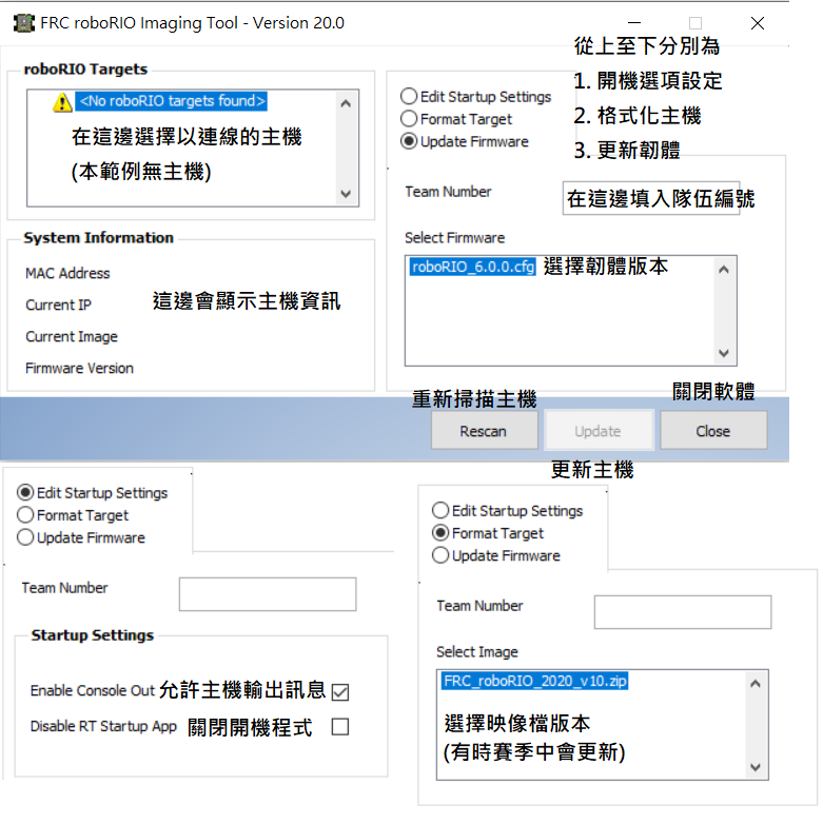
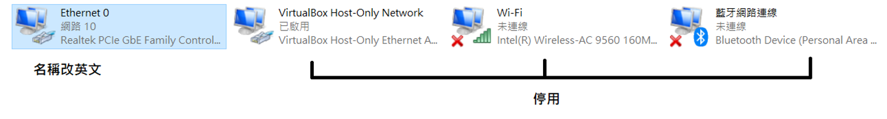
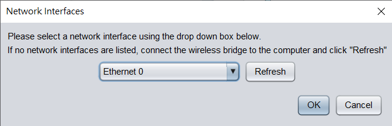

## 說明
FRC競賽為了保證競賽的公平性與安全性，提供與規範了許多可以配合比賽使用的軟硬體，因此必須學習這些軟體的使用。

## 設定 roboRIO
### 步驟
1. 使用 **USB線**連接roboRIO
2. 打開 roboRIO Imaging Tool
3. 選擇 roboRIO主機

### 注意事項
* 如果是全新或是舊賽季主機 **需要先更新韌體**
* roboRIO映像檔賽季開始後一樣會更新，需要注意官網以符合要求
* 開機選項通常**不用**修改

## 設定網路機(OM5P-AC)
### 步驟
1. 關閉藍芽
2. 進入**網路介面卡**選項，將連結到網路機之外的網路卡停用，並**將網路介面卡名稱設定為英文**。

3. 打開 FRC Radio Configuration Utility
4. 選擇以連線到網路機的介面卡
    1. 如果清單中沒有介面卡可以按 Refresh
    2. 好了就點 OK
    
5. 填寫 **隊伍編號**、**機器人名稱(選填)**、**網路密碼(選填)**、**工作模式**
6. 若是新網路機或舊賽季(2020賽季以前)網路機**必須先更新韌體(Load Firmware)**
7. 若韌體已經是最新版本則直接套用設定(Configure)即可

## 附錄
* [Programming your Radio](https://docs.wpilib.org/en/stable/docs/getting-started/getting-started-frc-control-system/radio-programming.html)
* [Imaging your roboRIO](https://docs.wpilib.org/en/stable/docs/getting-started/getting-started-frc-control-system/imaging-your-roborio.html)