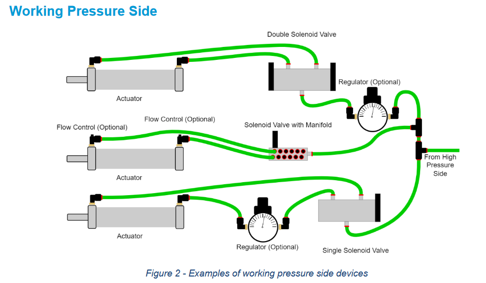
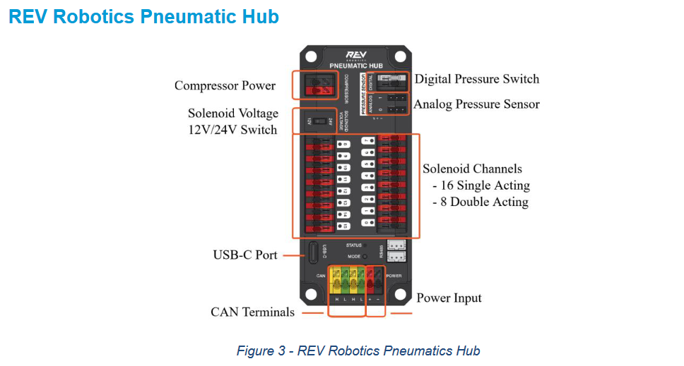
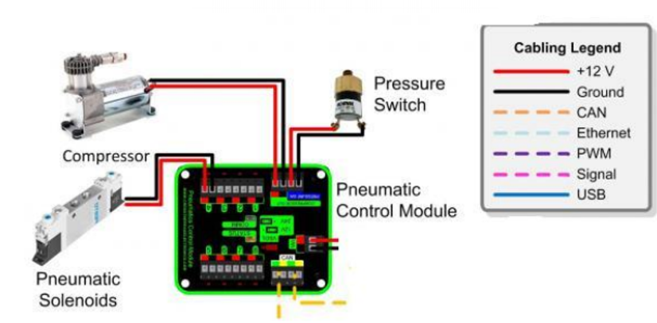

## 說明
FRC與其他機器人競賽有一項差異就是可以使用氣壓作為動力輸出。 但是氣壓在使用上若沒有正確操作會造成危險，所以需要特別進行規範。

## 氣壓系統組成
| 中文名稱 | 英文名稱 | 必須 |
| -------- | -------- | -- |
| 空氣壓縮機 | Compressor | |
| 氣體儲存瓶 | Air Tank(Reservoir) | |
| 壓力釋放閥 | Pressure Relief Valve | ✅ |
| 排氣塞 | Vent Plug | ✅ |
| 壓力開關 | Pressure Switch | ✅ |
| 壓力計 | Pressure Gauge | ✅ |
| 壓力調節器 | Pressure Regulator | ✅ |
| 控制器 | PCM, PH | ✅ |
| 電磁閥 | Solenoid | |
| 氣壓缸 | Cylinder | |

## 高壓區(儲存區)
高壓區主要用來進氣與儲存氣體，需要的零件包括：
* 壓縮機： 壓縮空氣，如果氣瓶儲存量夠大可以不安裝
* 壓力開關： 監測壓力是否達到120psi，控制壓縮機開關
* 壓力釋放閥： 用來釋放過高的壓力保證氣壓系統的安全
* 儲氣瓶： 儲存氣體
* 壓力計： **至少要安裝兩顆**，一顆檢測儲存壓力，一顆檢測工作壓力
* 排氣塞： 用於手動釋放壓力，建議後端可以安裝消音器減少噪音。若壓力釋放閥有手動釋放功能可以替代。
* 壓力調節器： **至少要有一個調節器**，用以把儲存壓力(120psi)降低為工作壓力(60psi)

## 工作區
工作區主要用來控制輸出元件，常見的零件包括：
* 電磁閥： 控制氣體流向，決定輸出元件的輸出方向
* 輸出元件： 氣壓缸，可以將氣壓轉換為動力
* 歧管： 可以將電磁閥組合在一起方便安裝
* 調節器： 當有多種工作氣壓時可以透過調節器調節

## 氣壓控制器
* REV Robotics Pneumatic Hub

* CTRE Pneumatic Control Module

## 附錄
其他安裝相關資料可以參考 [FRC Pneumatics Manual](https://www.firstinspires.org/sites/default/files/uploads/resource_library/frc/technical-resources/frc_pneumatics_manual.pdf)
