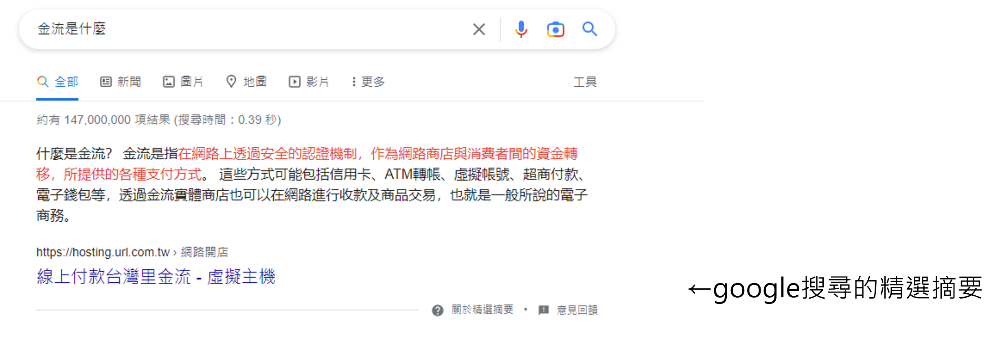
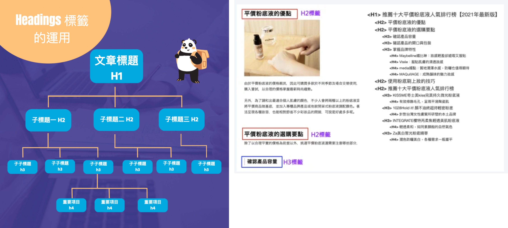
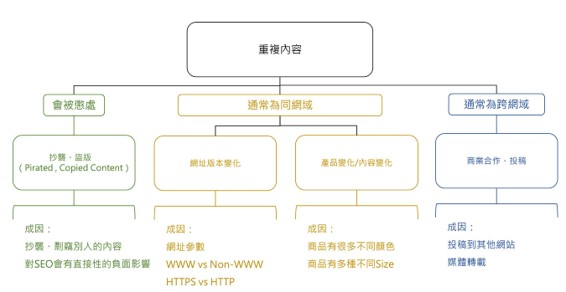

## SEO
### SEO是什麼?
* SEO, Search Engine Optimization, 最佳化搜尋引擎
* 透過自然排序增加網站能見度的行銷方式
* 長時間對網站的經營與改善，使搜尋引擎願意把網站主動推薦到搜尋頁面的頂端排名位置，增加網站能見度。

### 為什麼需要SEO?
* 網站流量來自很多地方，主要有以下三種：
    1. 搜尋引擎： Google, Yahoo, Bing
    2. 社群媒體： FaceBook, Instagram, Twitter
    3. 其他： 書籤列, 網址, EDM
    

* 使用網路時，不論要做什麼，最常做的動作就是打開瀏覽器，搜尋關鍵字
* 而在找東西時，通常就會依照搜尋結果點選前幾項，可能就會獲得答案，也停止瀏覽其他網站
* 因此就這樣的行為我們可以得知：

* 所以同理，排名越前面就可以獲得更多點閱如同黃金店面

## 搜尋引擎
* 搜尋引擎運作原理如下：
    1. 檢索，透過自動化程式抓取網路上的網站與內容
    2. 索引，分析網頁內容並將資料儲存在資料庫中
    3. 結果，根據輸入的關鍵字提供最符合的網頁
    

* 由原理可以得知：
    * SEO的領域包含非常多層面，小至網站內容大至使用者體驗，甚至是網站架構等
    * 依據知名SEO專業網站 Search Engine Land 在2021年更新的SEO元素週期表，大致可以分類如下：
    

## 2021 SEO 元素週期表

### 內容摘要
* 內容品質與深度
    * 內容是否有價值、架構完整、文筆流暢無誤
    * 專注於使用者優先的內容，理想狀況是使用者可以在網站輕鬆找到內容

* 內容/關鍵字研究
    * 了解使用者搜尋時使用的關鍵字與內容
    * 若使用者不會使用該關鍵字搜尋，在搜尋結果業也不會有比較好的排名

* 解答
    * 指的是解答使用者的問題
    * 除了提供答案，結構也要明確，讓使用者可以一目了然的找到答案
    * 好的設計可以增加被列入**精選摘要(Featured Snipped)** 的機會
    

* 將關鍵字部屬在重要區域
    * 在頁面的重要標籤(H1、H2、title)部屬重要的關鍵字
    * 不要濫用關鍵字或諞植於關鍵字密度，以內容品質為優先
    
    * 來源： [如何透過H標籤做好網站SEO？H標籤重要性介紹](https://awoo.ai/zh-hant/blog/h-tag/)
    * 來源： [SEO H1 H2 H3 是什麼？如何用 Headings 標籤架構文章內容？教學](https://www.seo-panda.tw/seo-h1-h2-h3-headings-202112/)

### 網站架構摘要
* 搜尋引擎爬蟲是否可以抓取網站資料
    * 不要讓爬蟲無法抓取網站內容或封鎖CSS、JS等造成無法正常讀取網站的方式

* 行動裝置優先
    * 以往強調友善的行動裝置體驗，但2021年起轉為行動裝置優先
    * 規劃網站內容與架構需要考慮是否能讓Google Mobile Bot正常讀取網站

* 體驗一致性
    * 桌面與手機版本盡量體驗一致，重要內容兩種版本都要顯示，以應對行動優先索引
    * 若內容只有桌面版則會被搜尋引擎忽略

* 重複性內容
    * 盡量避免重複性頁面，可以利用Google的網站管理員工具判斷
    * 可以利用標準網址(Canonical Tag)或301轉址解決

* 網站速度
    * 排名要素之一，可以用Page Speed Insight、WebPage Test 等工具檢查
    * 網站速度快有助於提升使用者體驗

### HTML摘要
* 網頁標題
    * 呈現在搜尋結果頁的標題是最重要的HTML要素
    * 文案與網頁內容若太長或無關，搜尋引擎便可能採用更好的文案呈現在結果頁，而不是根據網頁的設定

* 結構化資料
    * 利用結構化資料與複合資訊卡(Rich Snippet)優化搜尋結果頁呈現內容
    

### 負面要素
* 障眼法/隱藏文字
    * 不要利用障眼法讓搜尋引擎得到的版本與使用者不同
    * 最簡單的例子就是把css或js隱藏，但爬蟲可以取得

### 電子商務
* 網頁描述
    * 要好好寫商品描述，因為搜尋引擎無法辨識圖片中的文字
    * 重點商品描述要輸入文字，不要全部放在圖片中

此點也適用一般網站，能使用文字就不要用圖片省略，或是將文字放入alt中，可以讓爬蟲獲得圖片資訊

## 最基本的網站SEO
* 網站Head中的Meta與TKD
    * Head中會設定很多Meta安插內容，可以為SEO或社群媒體行銷帶來加分的項目
    * TKD是SEO中最重要的部分，代表網站中的
        * Title (標題)
        * Keywords (關鍵字)
        * Description (描述)

### TKD與網頁圖示
* Description
    * 必填，限制3~5個內容相關關鍵字
    * 建議把網站內容精華濃縮在這

* Keywords
    * 限制3~5個內容相關關鍵字
    * Google不列入SEO計分，其他搜尋引擎不一定

* Icon
    * 會出現在標題前方

* Title
    * 會出現在分頁上
    * 長度中文9~30，英文<=60

### Meta設定 - OG tag
* 全名 Open Graph Protocol，翻譯為 "開放社交關係圖"，由 Facebook在2010年推出
* OG的目標是讓網頁在社交關係圖可以豐富的呈現，讓我們在社群網站上分享時不只用網址呈現，而是用比較漂亮吸引人的方式呈現

* og:url，網頁的標準網址
    * 使用絕對路徑
    * 等同網頁在社交關係圖中的ID

* og:title，標題
    * 網頁分享時的標題文字
    * 通常與title相同

* og:description，描述
    * 網頁分享時的描述文字
    * 通常與description相同

* og:site_name，名稱
* og:image，縮圖
    * 網頁分享時的縮圖

* og:type，內容的媒體類型
    * 網頁固定使用 website

### 網站內容與關鍵字
* 網頁文字內容與關鍵字安排
    * 內容可以適時安插關鍵字
    * 不要為了SEO大量安插關鍵字

* 尋找SEO關鍵字的方法
    * SEO的首要任務是提出 **種子關鍵字**
    * 可以參考Google建議，在搜尋欄中輸入種子關鍵字，能夠得到最多人搜尋的關鍵字
    * 透過關鍵字與不同文字的組合拓展更多的訊息
    * 除了搜尋欄也可以參考結果提示詞

### 避免重複內容
* 內容是否大量重複，或是有沒有多個幾乎相同的網頁
* 重複內容的定義
    * 重複的內容
    * 多個不同網址，但內容相同的網頁
* 重複內容的類型
    * 爬蟲使用網址判斷，只要網址不同即視為不同的網頁
    

### 重複內容產生的問題
1. 權重分散
    * 若今天有三個網頁有相同內容，內容成因可能是版本不同或參數問題，Google不會懲罰，但只會給一頁排名
    * SEO有所謂的 **網頁權重** 存在，權重越高對SEO越有幫助
    * 使用者傳播、分享網頁時可以提高網頁的權重
    * 因此有多個相同內容的網頁，會使傳播時無法控制版本，導致提高的權重被分散

2. 影響爬蟲爬取網頁
    * 若爬蟲在爬取網頁時過於沒效率會對SEO有影響

### 轉址舊網站
* 假若今天不會使用到舊的網頁，善用轉址將舊網站跳轉到新網站
* 除了讓使用者不會停留在舊介面，也讓爬蟲把累計的分數與權重轉移到新網站
* 轉址類型
    * 301，永久轉址
    * 302，暫時轉址
    * 遮蔽轉址
* 避免網路出現重複內容降低SEO成效時通常使用 **301**

### 圖片加上alt屬性
* 幫助爬蟲識別圖片內容
* 近期開始注重無障礙網頁，加上alt屬性加強電腦輔助工具
* alt的目的
    * 圖片失效時使用文字替代
    * 輔助視障者運用電腦輔助工具理解圖片內容
    * 輔助爬蟲理解圖片內容
    
## 附錄
### 參考資料
* [SEO教學 - SEO初學者指南](https://www.newscan.com.tw/all-seo/seo-guide.htm)
* [2021年SEO元素週期表](https://www.wpandseo.tw/3212/seo-periodic-table-2021-content-architecture-html/)
* [google官方文件](https://developers.google.com/search/docs/fundamentals/seo-starter-guide?hl=zh-Hant&visit_id=638073702456484716-4074403719&rd=1)
* [如何撰寫SEO Title和Description (網頁TDK)？SEO優化的秘訣?](https://www.ibest.com.tw/news-detail/How-to-write-SEO-TDK/)
* [#21 No-code 之旅 — 如何讓網站在分享時看起來漂亮和有吸引力？Open Graph (OG) 簡介](https://ithelp.ithome.com.tw/articles/10278469)
* [Open Graph 是什麼？在活動網頁設定不同 OG，讓分享時更吸睛！](https://ryzo.io/open-graph-for-campaign-page/)
* [如何快速設定Facebook的OG Tag | 網站SEO優化](https://tzuhsiang.com/website-seo/facebookog-tag-seo/)
* [第六章：SEO關鍵字排名研究-如何找到有效高流量SEO關鍵字？](https://www.ibest.tw/seo-detail/keywords-research/)
* [認識SEO排名的殺手，『重複內容』超完整攻略](https://www.yesharris.com/seo-basic/content-duplicate-issue/)
* [10大轉址服務推薦！教你正確網頁轉址顧好SEO！](https://welly.tw/serp-rank-optimization/301-and-302-redirection-guide-for-seo)
* [Img Alt是什麼？好的替代文字怎麼寫？SEO專家教你7秘訣！](https://welly.tw/serp-rank-optimization/what-is-img-alt)