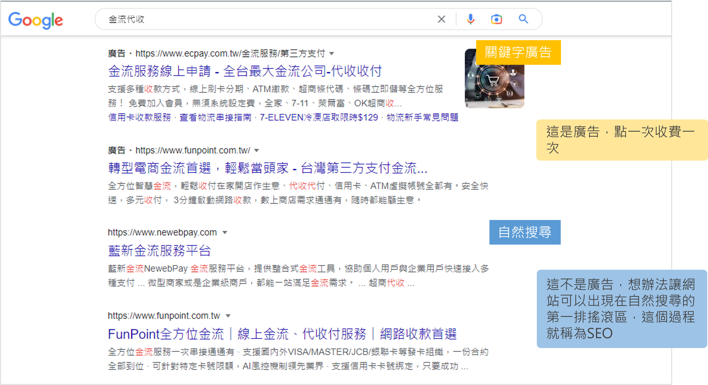
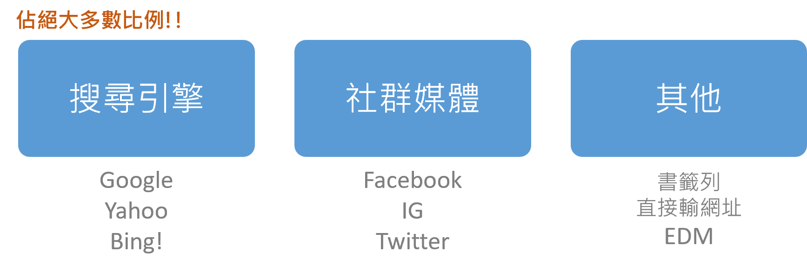
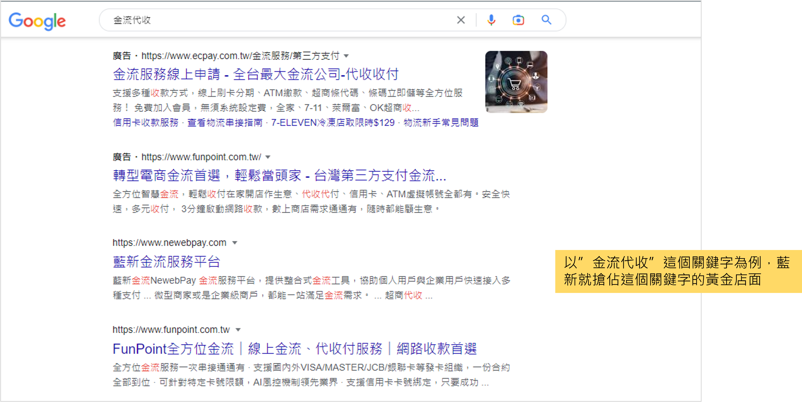
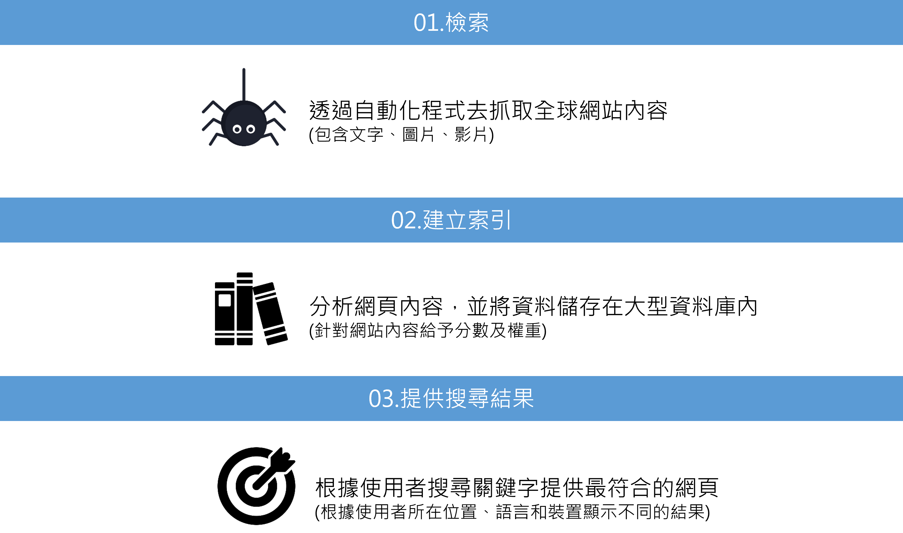

## SEO
### SEO是什麼?
* SEO, Search Engine Optimization, 最佳化搜尋引擎
* 透過自然排序增加網站能見度的行銷方式
* 長時間對網站的經營與改善，使搜尋引擎願意把網站主動推薦到搜尋頁面的頂端排名位置，增加網站能見度。

### 為什麼需要SEO?
* 網站流量來自很多地方，主要有以下三種：
    1. 搜尋引擎： Google, Yahoo, Bing
    2. 社群媒體： FaceBook, Instagram, Twitter
    3. 其他： 書籤列, 網址, EDM
    

* 使用網路時，不論要做什麼，最常做的動作就是打開瀏覽器，搜尋關鍵字
* 而在找東西時，通常就會依照搜尋結果點選前幾項，可能就會獲得答案，也停止瀏覽其他網站
* 因此就這樣的行為我們可以得知：

* 所以同理，排名越前面就可以獲得更多點閱如同黃金店面

## 搜尋引擎
* 搜尋引擎運作原理如下：
    1. 檢索，透過自動化程式抓取網路上的網站與內容
    2. 索引，分析網頁內容並將資料儲存在資料庫中
    3. 結果，根據輸入的關鍵字提供最符合的網頁
    

* 由原理可以得知：
    * SEO的領域包含非常多層面，小至網站內容大至使用者體驗，甚至是網站架構等
    * 依據知名SEO專業網站 Search Engine Land 在2021年更新的SEO元素週期表，大致可以分類如下：
    

    
## 附錄
### 2021 SEO 元素週期表

### 參考資料
* [SEO教學 - SEO初學者指南](https://www.newscan.com.tw/all-seo/seo-guide.htm)
* [2021年SEO元素週期表](https://www.wpandseo.tw/3212/seo-periodic-table-2021-content-architecture-html/)
* [google官方文件](https://developers.google.com/search/docs/fundamentals/seo-starter-guide?hl=zh-Hant&visit_id=638073702456484716-4074403719&rd=1)
* [如何撰寫SEO Title和Description (網頁TDK)？SEO優化的秘訣?](https://www.ibest.com.tw/news-detail/How-to-write-SEO-TDK/)
* [#21 No-code 之旅 — 如何讓網站在分享時看起來漂亮和有吸引力？Open Graph (OG) 簡介](https://ithelp.ithome.com.tw/articles/10278469)
* [Open Graph 是什麼？在活動網頁設定不同 OG，讓分享時更吸睛！](https://ryzo.io/open-graph-for-campaign-page/)
* [如何快速設定Facebook的OG Tag | 網站SEO優化](https://tzuhsiang.com/website-seo/facebookog-tag-seo/)
* [第六章：SEO關鍵字排名研究-如何找到有效高流量SEO關鍵字？](https://www.ibest.tw/seo-detail/keywords-research/)
* [認識SEO排名的殺手，『重複內容』超完整攻略](https://www.yesharris.com/seo-basic/content-duplicate-issue/)
* [10大轉址服務推薦！教你正確網頁轉址顧好SEO！](https://welly.tw/serp-rank-optimization/301-and-302-redirection-guide-for-seo)
* [Img Alt是什麼？好的替代文字怎麼寫？SEO專家教你7秘訣！](https://welly.tw/serp-rank-optimization/what-is-img-alt)