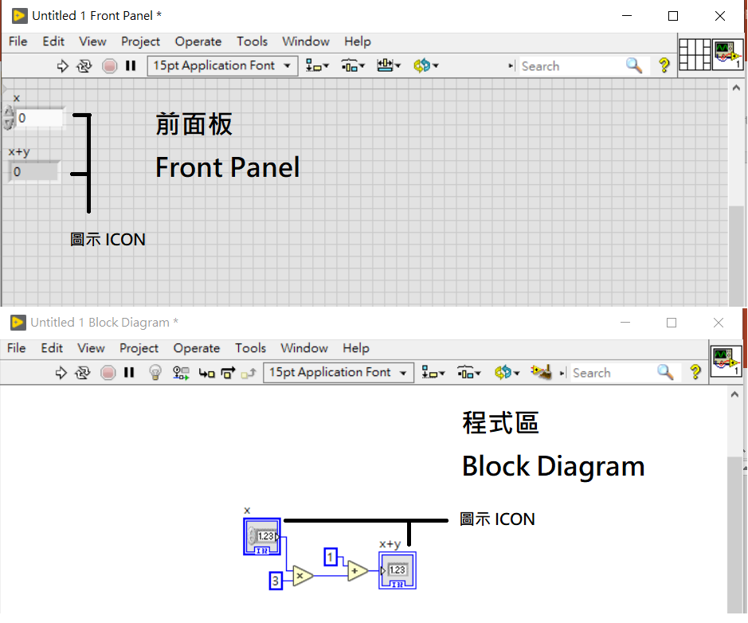

## 簡介
LabVIEW 全名為 **Lab**oratory **V**irtual **I**nstrumentation **E**ngineering **W**orkbench, 實驗室虛擬儀器工程平台 
由NI (National Instrument, 國家儀器)所開發的程式語言 
早期是為了方便儀器自動控制所開發，擁有圖形化介面，容易上手 
透過資料流與方塊化模式進行程式撰寫 
LabVIEW的程式碼附檔名為VI，代表虛擬儀器(Virtual Instrument)

## Labview的優缺點
### 優點
* 不用像一般寫程式時要熟悉語法，有提供圖形化函式庫方便查找
* 擁有大量的函式庫，包括數學、邏輯、圖形、資料的相關處理
* 編譯簡單，會自動帶入編譯器所需要的資料，不需要處理編譯上的問題
* 平行編程，由於透過資料流作為主結構，因此LabVIEW帶有排程演算法能夠自動將程式變為多執行續，不用煩惱多執行續的問題

### 缺點
* 執行效率低落，不管程式大小都必須在RT環境中執行，導致整體效率被拖慢
* 圖形化，導致程式在複雜的時候沒辦法快速釐清順序
* 沒有變焦功能，方塊大小會受到解析度影響
* 專有軟體，社群較小且程式碼不受其他機構管控，語法上會有不同

## LabVIEW的特性
### 資料流
透過資料的傳遞決定程式的執行順序，每個方塊都必須等待輸入準備完畢後才會執行並將結果輸出

### 圖形化編程
* 與Scratch(Blockly)有點類似，但原理上不一樣，前者是先將文字型語言的語法轉換為方塊再進行操作，因此還是需要先將方塊轉回程式碼再進行編譯
* LabVIEW則是透過資料流操作，因此在結構上不會像Scratch有明確的順序

### 圖形化介面
* 每個LabVIEW程式碼會被稱為VI，包括前面板、程式、圖示
* 快捷鍵：ctrl+t將畫面分割為前面板與程式區各一半、ctrl+u自動整線、右鍵呼叫函式庫

## 附錄
### 參考資料
* [Wikipedia - LabVIEW](https://en.wikipedia.org/wiki/LabVIEW)
