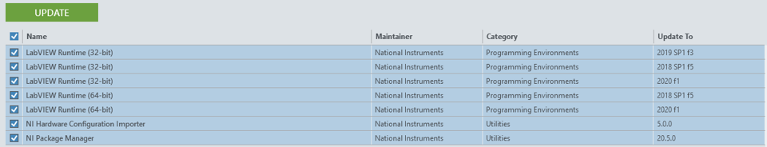

### 解除安裝舊版本
首先要打開 NI Package Manager，選到 Installed 標籤，將套件全選並按下 Remove。

### 下載新的Labview
前往 [Labview for FRC](https://www.ni.com/en-us/support/downloads/software-products/download.labview-software-for-frc.html) 選擇版本並下載安裝檔。 
依照網路狀況選擇在線或離線安裝。 

### 下載FRC Game Tool
前往 [FRC Game Tools](https://www.ni.com/zh-tw/support/downloads/drivers/download.frc-game-tools.html) 選擇賽季版本並下載安裝檔。 
依照網路狀況選擇在線或離線安裝。 

### 安裝Labview
首先安裝Labview本體，接著再安裝 GameTool。 
一路下一步跟我同意，漫長的等待後就可以輸入序號了，若沒有序號也可以先跳過使用試用版，安裝完成後要重新開機。

### 更新Labview
打開 NI Package Manager，選擇 Updates 標籤確認可用更新，全選可更新項並按下 Update。 
若過程中有更新到 NI Package Manager，更新完後要重複上面的步驟一次。 
