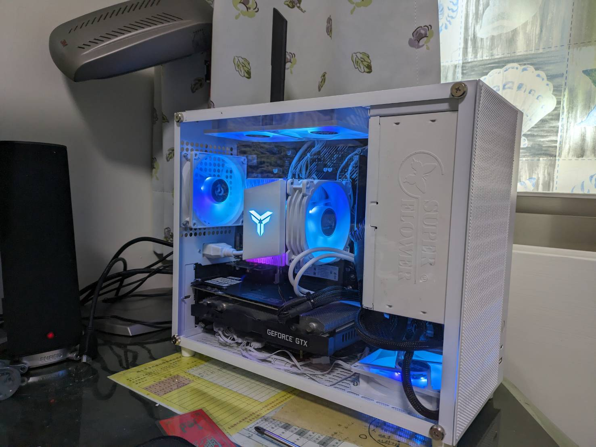
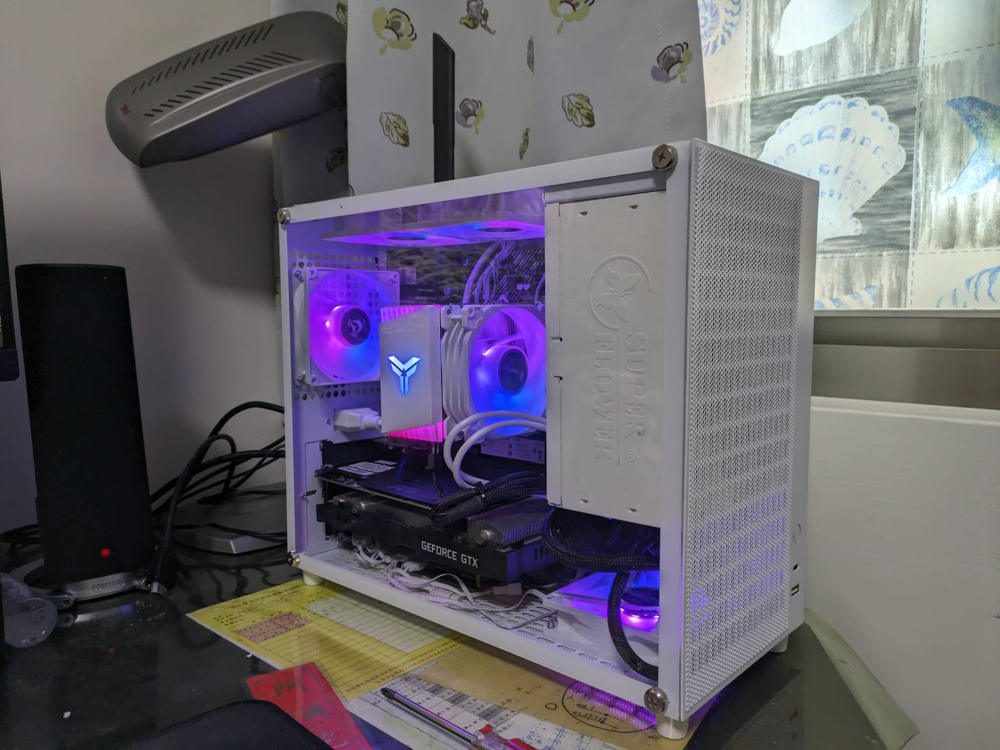
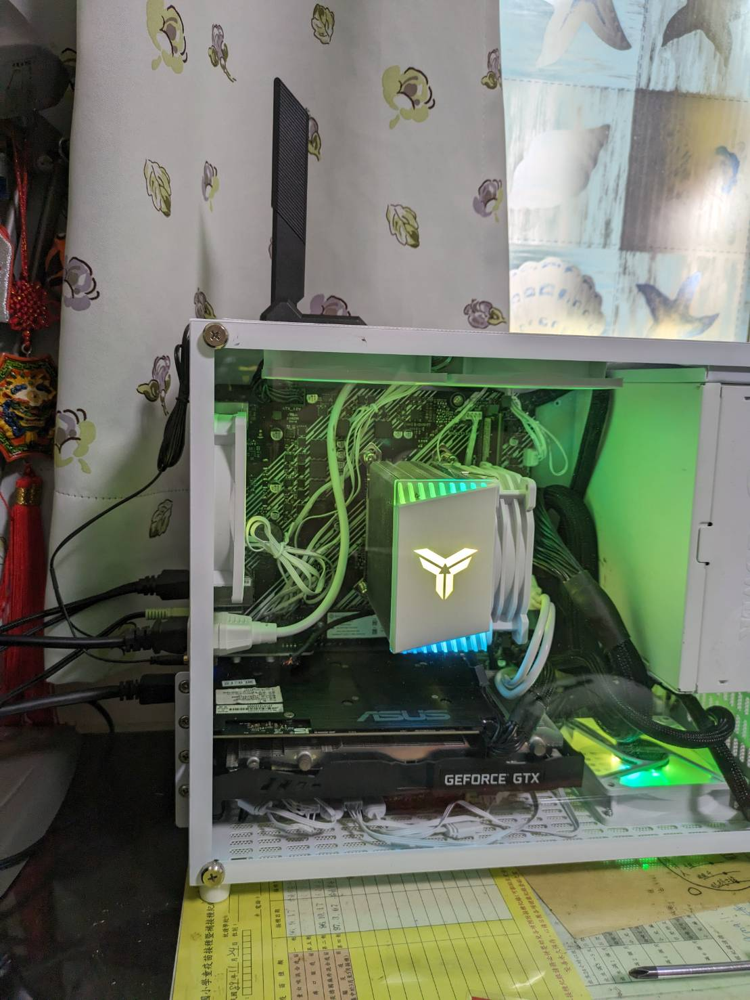

## 簡介
最近組到了各式各樣奇葩零件的電腦，紀錄一下美好生活。 
主要組件為常見的AM4平台，R5 3600搭配B550M的組合。 
加上 GTX 1060，日常使用以及基本遊戲體驗都沒問題。

## 規格
|零件|型號|大略價位|
|--|--|--|
|CPU|[AMD Ryzen 5 3600](https://www.amd.com/zh-hant/product/8456)|2500|
|GPU|華碩 ASUS Strix GTX-1060|1800|
|MB |[華碩 ASUS B550m-k argb/csm](https://www.asus.com/tw/motherboards-components/motherboards/csm/prime-b550m-k-argb-csm/)|2000|
|Cooler|[喬思伯 Jonsbo CR1400 ARGB](https://www.jonsbo.com/products/CR1400.html)|450|
|RAM|[十銓 TEAM Elite DDR4 3200 16GB*1](https://www.teamgroupinc.com/tw/product-detail/memory/TEAMGROUP/elite-u-dimm-ddr4/elite-u-dimm-ddr4-TED416G3200C2201/)|750|
|SSD|[Solidigm P41 Plus 512GB](https://www.solidigmtechnology.cn/products/client/plus-series/p41.html)|800|
|SSD|[美光 Micron Crucial P1 1TB](https://www.crucial.tw/products/ssd/p1-ssd)|1500|
|Power|[振華 SuperFlower Leadex Gold 650W](https://www.super-flower.com.tw/zh-TW/products/leadex-gold-650w)|1000|
|Case|[笨牛機箱 E15](https://world.taobao.com/item/720957198918.htm)|1000|
|Wifi|[Intel AX200](https://www.intel.com.tw/content/www/tw/zh/products/sku/189347/intel-wifi-6-ax200-gig/specifications.html)|700|
|**總計**||12500|

## 照片
  

## 優缺點
|零件|優點|缺點|
|--|--|--|
|Ryzen5 3600|入門U，二手便宜好用|比較舊一點的U加AMD祖傳積熱問題，建議配塔散|
|GTX1060|入門款，基本上都跑得動|老了，二手價不人性|
|B550m-k argb/csm|目前感覺CP值最高的AM4主板，配ARGB|電源配置比較普通，不建議往上硬推 記憶體只有兩槽|
|CR1400|小機殼+ARGB好用，新品也不貴||
|Elite D4 32 16G|就最簡單的便宜貨|都這麼普通了好像也不能苛求|
|P41 Plus 512G|目前拋盤常見的硬碟，CP值比較高|SSD算耗材吧|
|P1 1T|從舊機上拆下來的，就資料碟，反正夠快|有很多平替|
|Leadex Gold 650W|金牌電源，白的|體積相對大，大陸廠商|
|E15|15L體積，同級距較小的組合，功能性很夠|提把設計不良，大陸廠商 鐵殼比較重，要輕可以考慮換鋁的 這台備品少給我，有找其他廠商的|
|AX200|現在不貴的Wifi 6無線網路卡||

## 結論：性能足夠，日常用猛的一批
AMD這個組合性能不足時可以再超頻，但因為主板電源設計跟CPU積熱問題不建議過於激進。 
這個機殼組合的問題在於線很難整理，體積過小的情況下還要整理ARGB線材與風扇電源線 
建議可以用大一點點的機殼(18L/20L)。