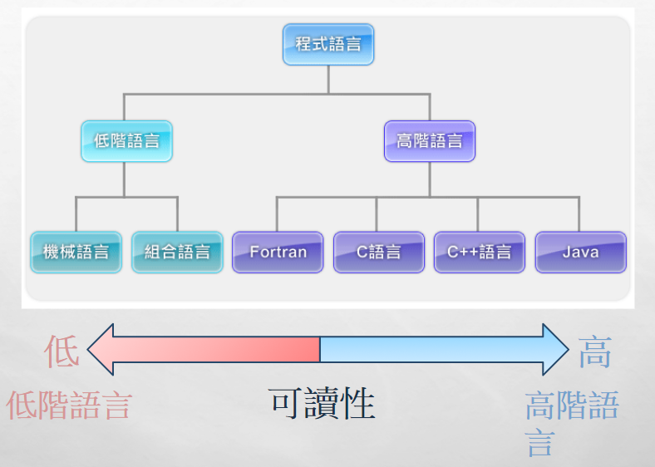

## 程式的用途
* 透過電腦輔助計算有很多的用途，不論是商業、工業、教育、軍事或日常都有很多的應用可以透過電腦輔助。
* 但因為電腦本身並無法理解語言，只能透過電訊號傳遞資料，也就是所謂的機械碼。為了讓人們可以更方便去操作電腦，也就有了程式語言，可以幫助人們用熟悉的方式操作電腦。
* 因為電腦可以應用在很多領域，因此在不同的應用中會使用不同的語言。例如：
    * 晶片系統中常會使用 C、C++
    * 跨平台開發可以使用 JAVA、Python
    * 商業應用較常出現 Cobol

## 程式語言的分類
### 高階或低階
* 高階語言與低階語言通常是用易讀性作為分類依據，越接近人類語言的程式語言通常也較高階
* 高階語言由於接近自然語言，因此在開發上較為容易。
* 低階語言則更接近機器語言，通常可以獲得更高的效率。

### 直譯或編譯
* 編譯指的是將程式語言轉換為機器碼的過程。
* 編譯語言是先將程式**全部**轉換為機器碼再執行。
* 直譯語言則是依照程式編寫的順序在執行的過程中編譯。
* 也有混和型的語言，例如：Java或C#可以先編譯一部分的程式為機器碼，加快執行的效率。

## 程式語言的開發環境
### 編輯器? 編譯器?
* 編輯器(Editor)是撰寫程式的工具，不包含將程式語言轉換為機器碼的功能。
    * 常用的編輯器包括：VSCode、Vim、Notepad 等
* 編譯器(Compiler)是將程式語言轉換為機器碼給電腦執行的工具，不同的程式語言就會使用不同的編譯器。
    * C與C++ 使用 gcc/g++、Java 使用 JDK

### 整合式開發環境 (IDE)
整合式開發環境(IDE, Integrated Development Environment)，會整合好編輯器與編譯器的功能，甚至可以針對機器碼進行除錯工作。

## 程式的運作流程
一段程式通常會需要經過以下的流程才能執行(以C為例)
1. 預先處理
2. 編譯
3. 組譯
4. 連結
5. 輸出執行檔
不同的程式語言需要經過的流程不同，但原理大同小異。